<a href="https://www.vilaayali.com/"></a>

  
  
  
  

<picture>
  <source media="(prefers-color-scheme: dark)" srcset="./assets/title-about.svg" />
  
</picture>

  
  

<picture>
  <source media="(prefers-color-scheme: dark)" srcset="./assets/title-experience.svg" />
  
</picture>


<picture>
  <source media="(prefers-color-scheme: dark)" srcset="./assets/title-work.svg" />
  
</picture>

  <a href="https://github.com/vilaayali"></a>
  <a href="https://github.com/vilaayali"></a>
  <a href="https://github.com/vilaayali"></a>
  <a href="https://www.vilaayali.com/"></a>

<picture>
  <source media="(prefers-color-scheme: dark)" srcset="./assets/title-stack.svg" />
  
</picture>


<picture>
  <source media="(prefers-color-scheme: dark)" srcset="./assets/title-activity.svg" />
  
</picture>

<picture>
  <source media="(prefers-color-scheme: dark)" srcset="./profile-3d-contrib/profile-night-rainbow.svg" />
  
</picture>

  
  

<picture>
  <source media="(prefers-color-scheme: dark)" srcset="https://raw.githubusercontent.com/vilaayali/vilaayali/output/snake-dark.svg" />
  
</picture>

<a href="mailto:vilaayali89@gmail.com"></a>
