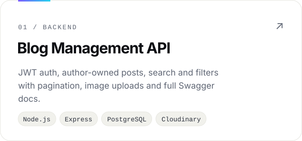
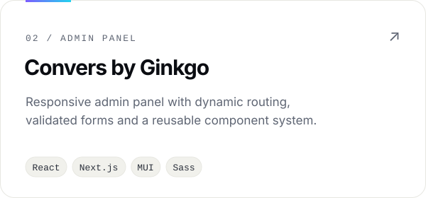
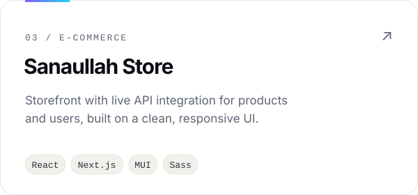
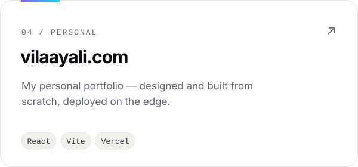

<picture>
  <source media="(prefers-color-scheme: dark)" srcset="./assets/header-dark.svg" />
  <source media="(prefers-color-scheme: light)" srcset="./assets/header-light.svg" />
  
</picture>

  
  
  
  

 

<code>01 — ABOUT</code>

### I build interfaces that feel instant.

Software Engineer with **2+ years** shipping production web apps in **React, Next.js and Node.js**. I care about the details users notice without knowing why — snappy load times, smooth real-time updates, and UIs that hold up on every screen.

<table>
<tr>
<td width="33%" valign="top">REAL-TIME <b>Live device data over WebSockets</b></td>
<td width="33%" valign="top">PERFORMANCE <b>2× faster responses with lazy loading & Redux</b></td>
<td width="33%" valign="top">SCALE <b>Large B2B e-commerce platform</b></td>
</tr>
</table>

 

<code>02 — EXPERIENCE</code>

| Period | Role | Company | Focus |
| :-- | :-- | :-- | :-- |
| `2025 — 2026` | **Associate Software Engineer** | Bestel Communications | Real-time network app, WebSockets, REST APIs, Tailwind · Shadcn · MUI |
| `2024 — 2025` | **Junior Software Engineer** | Ginkgo Retail | B2B storefront & admin panel, component library, high-volume data |
| `Education` | **A.A.S Computer Programming** | European University of Lefke | Cyprus |

 

<code>03 — SELECTED WORK</code>

<table>
<tr>
<td width="50%">
<a href="https://github.com/vilaayali">
<picture>
  <source media="(prefers-color-scheme: dark)" srcset="./assets/blog-api-dark.svg" />
  
</picture>
</a>
</td>
<td width="50%">
<a href="https://github.com/vilaayali">
<picture>
  <source media="(prefers-color-scheme: dark)" srcset="./assets/convers-dark.svg" />
  
</picture>
</a>
</td>
</tr>
<tr>
<td width="50%">
<a href="https://github.com/vilaayali">
<picture>
  <source media="(prefers-color-scheme: dark)" srcset="./assets/sanaullah-dark.svg" />
  
</picture>
</a>
</td>
<td width="50%">
<a href="https://www.vilaayali.com/">
<picture>
  <source media="(prefers-color-scheme: dark)" srcset="./assets/portfolio-dark.svg" />
  
</picture>
</a>
</td>
</tr>
</table>

 

<code>04 — TOOLKIT</code>

<picture>
  <source media="(prefers-color-scheme: dark)" srcset="https://skillicons.dev/icons?i=react,nextjs,js,tailwind,redux,materialui,sass,vue,bootstrap,nodejs,express,postgres,mysql,mongodb,git,github,vercel,postman&perline=9&theme=dark" />
  
</picture>

Also: Socket.io · shadcn/ui · TanStack Query · Sequelize · Mongoose · JWT · Zod · Cloudinary · Swagger

 
 

<code>05 — ACTIVITY</code> &nbsp;·&nbsp; includes private repositories

  
  

<picture>
  <source media="(prefers-color-scheme: dark)" srcset="https://streak-stats.demolab.com?user=vilaayali&hide_border=true&background=0B0D12&ring=7C5CFF&fire=22D3EE&currStreakLabel=F2F4F8&sideLabels=8A93A6&currStreakNum=F2F4F8&sideNums=F2F4F8&dates=8A93A6&stroke=1C2130&border_radius=20" />
  
</picture>

<picture>
  <source media="(prefers-color-scheme: dark)" srcset="https://raw.githubusercontent.com/vilaayali/vilaayali/output/snake-dark.svg" />
  
</picture>

 

Designed & built by Syed Vilaay Ali — Lahore, PK

