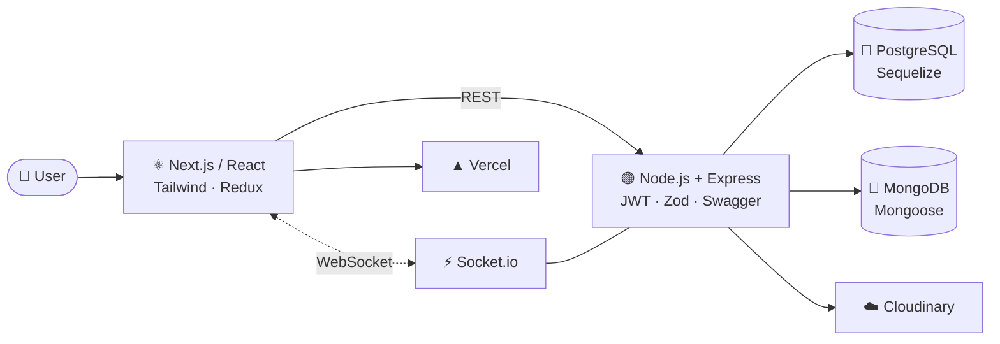
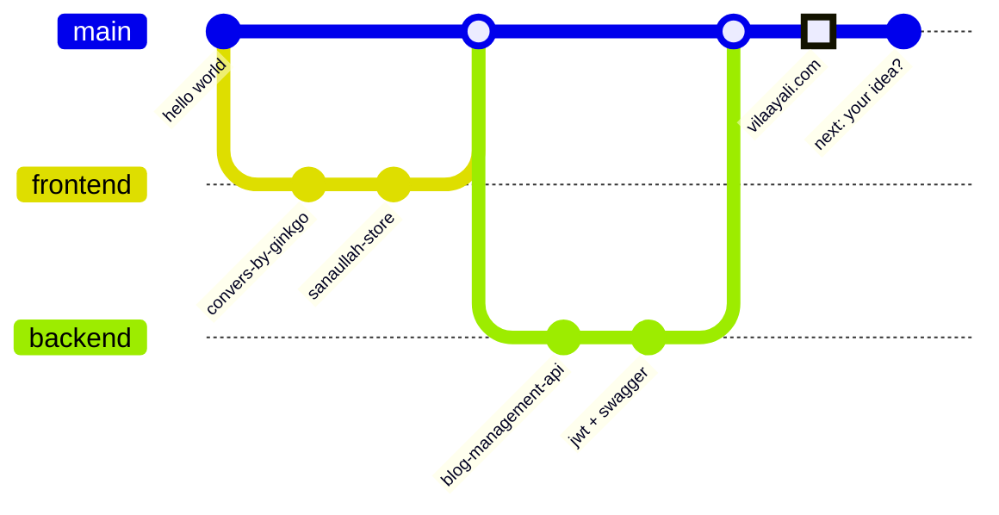

<a id="top"></a>

<a href="https://www.vilaayali.com"></a>

<div align="center">

### 🔗 [vilaayali.com](https://www.vilaayali.com)

[](https://www.vilaayali.com)
[](https://linkedin.com/in/syedvilaayali)
[](mailto:vilaayali89@gmail.com)

[](#)
[](#%EF%B8%8F-releases)
[](#-dependencies)
[](#-dependencies)
[](#-dependencies)
[](#-license)
[](https://github.com/vilaayali?tab=followers)
[](https://github.com/vilaayali?tab=repositories)


[**Install**](#-installation) · [**Usage**](#-usage) · [**Projects**](#-projects) · [**Architecture**](#%EF%B8%8F-architecture) · [**Changelog**](#-git-log) · [**Activity**](#-activity) · [**Contributing**](#-contributing) · [**FAQ**](#-faq)

</div>

> [!TIP]
> **Open to collaborations.** Got a project in mind? Jump to [Contributing](#-contributing) — I usually reply within a day.

## 📦 Installation

```bash
git clone https://github.com/vilaayali/vilaayali.git
cd vilaayali && open https://www.vilaayali.com
```

## ✨ Features

```diff
- slow pages, full reloads, undocumented endpoints
+ instant UIs, live updates over WebSockets, APIs with Swagger docs
```

- ⚡ **Real-time** — live data streaming over WebSockets
- 🔐 **APIs** — REST with JWT auth, Zod validation and Swagger docs
- 🎨 **UI** — responsive, lazy-loaded, pixel-tidy
- 🛒 **Commerce** — storefronts and admin panels built to scale

## 🚀 Usage

```ts
import { vilaayali } from "vilaayali";

const app = await vilaayali.build({
  frontend: ["React", "Next.js", "Tailwind", "Redux"],
  backend:  ["Node.js", "Express", "PostgreSQL", "MongoDB"],
  realtime: "Socket.io",
});

app.ship(); // ✔ compiled  ✔ tested  ✔ deployed
```

## 📁 Projects

| | Project | What it does | Built with |
| :-: | :-- | :-- | :-- |
| 🔐 | [**blog-management-api**](https://github.com/vilaayali) | REST API with auth, posts, search & uploads | `Node.js` `Express` `PostgreSQL` |
| 🧭 | [**convers-by-ginkgo**](https://github.com/vilaayali) | Admin panel with routing & validated forms | `React` `Next.js` `MUI` |
| 🛒 | [**sanaullah-store**](https://github.com/vilaayali) | Storefront wired to live product APIs | `Next.js` `Sass` |
| 🌐 | [**vilaayali.com**](https://www.vilaayali.com) · [code](https://github.com/vilaayali/vilaayali_portfolio) | My personal site | `React` `Vite` `Vercel` |

<details>
<summary><b>blog-management-api</b> — more details</summary>

<br>

- JWT authentication with author-owned posts
- Search, filters and pagination
- Image uploads via Cloudinary
- Full Swagger / OpenAPI docs
- `Node.js` · `Express` · `PostgreSQL` · `Sequelize` · `Zod`

</details>

<details>
<summary><b>convers-by-ginkgo</b> — more details</summary>

<br>

- Responsive admin panel with dynamic routing
- Validated forms and a reusable component library
- `React` · `Next.js` · `MUI` · `Sass`

</details>

<details>
<summary><b>sanaullah-store</b> — more details</summary>

<br>

- Storefront integrated with live product and user APIs
- Clean, responsive UI across devices
- `React` · `Next.js` · `MUI` · `Sass`

</details>

## 🏗️ Architecture

How I usually put an app together:



## 🌳 git log



## 🧱 Dependencies

```json
{
  "dependencies": {
    "react": "latest", "next": "latest", "redux": "latest",
    "tailwindcss": "latest", "@tanstack/react-query": "latest",
    "node": "latest", "express": "latest", "socket.io": "latest",
    "postgresql": "latest", "mongodb": "latest"
  },
  "devDependencies": { "coffee": "*", "git": "*", "vercel": "*" }
}
```

## 📊 Activity

> [!NOTE]
> Stats include private repositories.

 



<p align="center"></p>


## 🏷️ Releases

| Version | Notes |
| :-- | :-- |
| **v2026.10** `latest` | New profile · open to collaborations |
| v2025.08 | Real-time apps over WebSockets |
| v2024.11 | First production e-commerce work |

## 🤝 Contributing

> [!IMPORTANT]
> Ideas, projects and bug reports welcome. Press <kbd>Ctrl</kbd> + <kbd>Enter</kbd> on an [email to me](mailto:vilaayali89@gmail.com), or ping me on [LinkedIn](https://linkedin.com/in/syedvilaayali).

## ❓ FAQ

<details>
<summary><b>Are you open to freelance or contract work?</b></summary>
<br>
Yes — <a href="mailto:vilaayali89@gmail.com">email me</a> with a short brief and timeline.
</details>

<details>
<summary><b>What kind of projects do you enjoy most?</b></summary>
<br>
Real-time apps, dashboards and anything where speed and clean UX matter.
</details>

<details>
<summary><b>Where can I see more of your work?</b></summary>
<br>
On <a href="https://www.vilaayali.com">vilaayali.com</a> and in the pinned repositories below.
</details>

## 📄 License

MIT © Syed Vilaay Ali — free to reach out, fork ideas and build together.

<div align="center">
<br>
<sub>Made with ☕ · ⭐ star a repo if something helped · <a href="#top">back to top ↑</a></sub>
</div>
